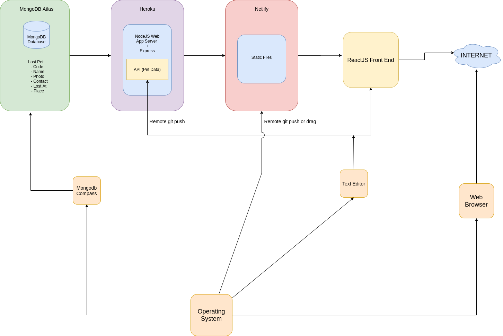
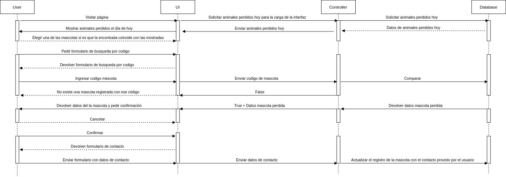

# Pet-Lost
This is a web application to find lost pets

## Git workflow recomendations

- First create a fork clicking on "fork" button as follows  
  
---
- Clone your fork repo in local with this git command  
  `git clone <fork remote link>`  
---
- Rename the remote repo reference  
  `git remote rename <old> <new remote name>`   
  _I recommend call the new remote as "fork"_  
---
- Add the original remote repo in local with this git command    
  `git remote add origin <remote link>`  
---
- Create a new branch in your fork repo with this git command     
  `git checkout -b <new branch name>`  
---
- Work in your branch until the changes are made, then make push in the remote repo as follows  
  `git push -u <new remote name> <new branch name>` or `git push <new remote name> <new branch name>`   
---
- Once the files are online, make a new pull request from your branch, if everything is fine, your request will be merged with the main branch

#Software Architecture  
- The platforms that will be used to host our application are the following:  
  
---  
#Sequence Diagram "user - View - Controller - Model"      
- The general idea when the user interacts with the user interface will be the next one:  
  
---  
